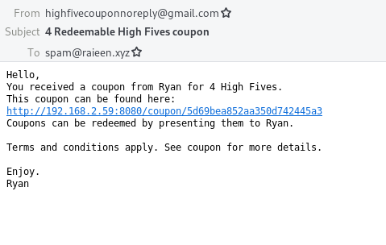

# Coupon Web Server

Goes with [Coupon App](https://github.com/Raieen/CouponApp)

Have you ever wanted a system to give people your own coupons? Probably not. But this is it.

Coupon Web Server is a web server that handles coupons using Spring and MongoDB.

Every coupon is displayed as a webpage with a QR code to be scanned by the companion coupon app.

Whenever a coupon is created, an email is sent to the coupon recipient.

Used Spring, MongoDB and JavaMail.

Customize things in application.properties.

## Images

<small>//TODO: Write a better README in the future.</small>

